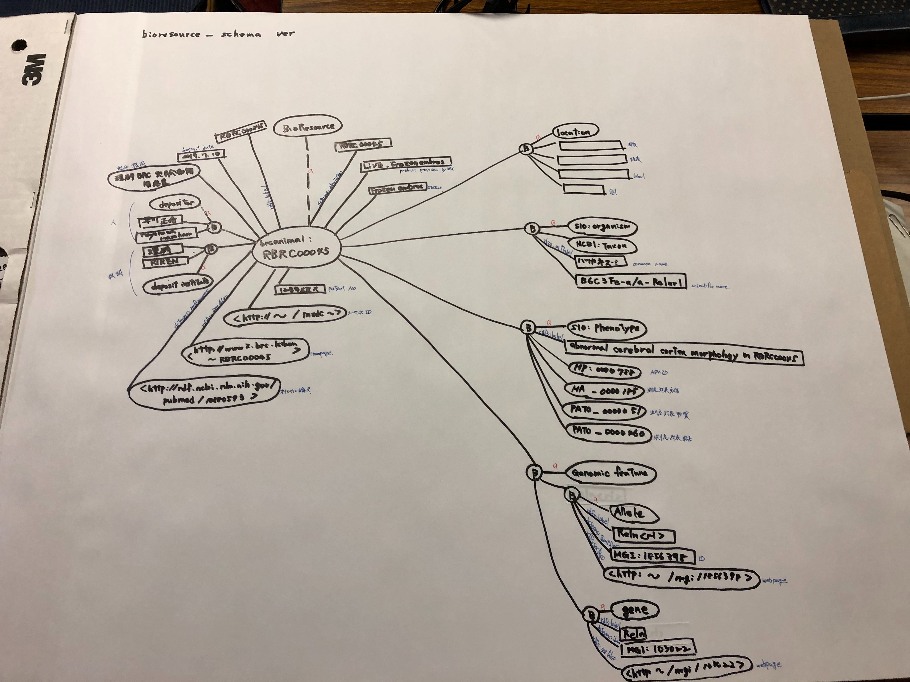
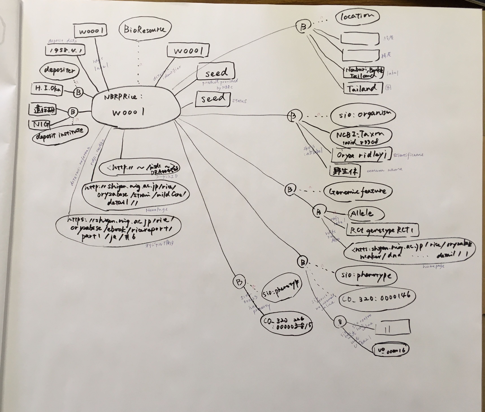

# NBRPO
NBRPO is an ontology which is intended for describing meta information of biological resources retained and provided by biological resource centers.

## RDF data model

## Contributors

- Hiromi Kanegae (NARO)
- Shoko Kawamoto (NIG)
- Shuichi Kawashima (DBCLS)
- Hiroshi Masuya (Riken)
- Terue Takatsuki (DBCLS)
